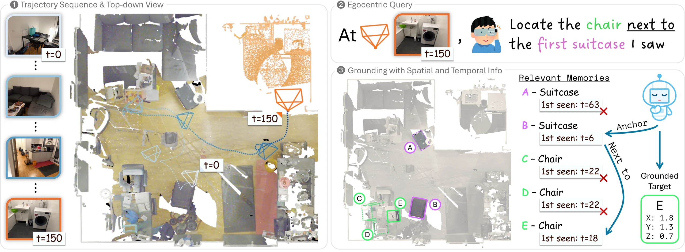

# EgoRecall

### EgoRecall: 3D Visual Grounding from Streaming Egocentric Observations

[Hou In Ivan Tam](https://iv-t.github.io/), [Manolis Savva](https://msavva.github.io/)



[Page](https://3dlg-hcvc.github.io/EgoRecall/) | [Paper]() | [Data](https://huggingface.co/datasets/3dlg-hcvc/EgoRecall)


## Environment Setup
Create and activate the conda environment as follows.
Run the following commands from the root of the repository:
```bash
# Create and activate the environment
conda env create -f environment.yml
conda activate egorecall

# Install the egorecall package
python -m pip install --no-build-isolation -e .
```


## Dataset Setup

### 1. Download the EgoRecall Dataset
First, agree to the terms and request access on [Hugging Face](https://huggingface.co/datasets/3dlg-hcvc/EgoRecall).
Once approved, log in to Hugging Face on your machine ([guide](https://huggingface.co/docs/huggingface_hub/en/quick-start#authentication)) and download the dataset (about 110 MB):
```bash
# Install the Hugging Face command-line tools
python -m pip install --no-build-isolation -e ".[hub]"

hf auth login
hf download 3dlg-hcvc/EgoRecall --repo-type dataset --local-dir /path/to/EgoRecall_hf
```
The download contains queries, answers, frame mappings, and object visibility annotations for all 183 scenes.


### 2. Download ScanNet++
Our dataset builds on [ScanNet++ v2](https://scannetpp.mlsg.cit.tum.de/scannetpp/), which provides the RGB-D frames, camera poses, and object boxes for each scene.
Request access and download the data following the instructions on the ScanNet++ website.
Keep its original directory layout unchanged.
Each scene needs the following files, which take about 117 GB for the 70 test scenes and 292 GB for all 183 scenes:
```
scannetpp/v2
└── data
    ├── 036bce3393
    │   ├── iphone
    │   │   ├── rgb.mkv
    │   │   ├── rgb_mask.mkv
    │   │   ├── depth.bin
    │   │   ├── pose_intrinsic_imu.json
    │   │   └── exif.json
    │   └── scans
    │       └── segments_anno.json
    ├── ...
```
`configs/benchmark_splits.json` lists the subset of 183 scenes used in EgoRecall and their splits.


### 3. Configure Paths
Copy `configs/paths.example.toml` to `configs/paths.toml` and set the three locations:
```toml
[paths]
dataset_root = "/path/to/EgoRecall_hf"      # the downloaded EgoRecall dataset
scannetpp_root = "/path/to/scannetpp/v2"    # the ScanNet++ folder that contains data/
cache_root = "/path/to/egorecall_cache"     # directory for storing step 4's output
```


### 4. Prepare Observations
Extract relevant data from the ScanNet++ files using our command-line tools.
The prepared files are stored in `cache_root` and are ready for use by our Python API for training and evaluation.

`egorecall-prepare` reads each scene's ScanNet++ files and packs its sampled frames, cameras, and object boxes into one H5 file in `cache_root`.
```bash
# Prepare all scenes for a split (train, val, or test)
egorecall-prepare --config configs/paths.toml --split test

# Prepare a single scene
egorecall-prepare --config configs/paths.toml --split test --scenes 036bce3393
```

`egorecall-check` checks the validity of the EgoRecall annotations, the ScanNet++ files, and the prepared files.
```bash
# Check the annotations and ScanNet++ files for a split (train, val, or test)
egorecall-check --config configs/paths.toml --source --split test

# Check the prepared files for a split (train, val, or test)
egorecall-check --config configs/paths.toml --cache --split test

# Check the annotations, plus one scene's ScanNet++ files and prepared file
egorecall-check --config configs/paths.toml --source --cache --scenes 036bce3393
```
See `egorecall-prepare --help` and `egorecall-check --help` for more options.

**Storage Requirements**
- Train: 100 scenes, ~31 GB
- Val: 13 scenes, ~4 GB
- Test: 70 scenes, ~23 GB


## Quick Start
Load a query and the frames observed up to its query time:
```python
from pathlib import Path

from egorecall import DatasetPaths
from egorecall.data import EgoRecallDataset

# Select the test queries evaluated in the paper: test stages 1 to 5
dataset = EgoRecallDataset(DatasetPaths.from_toml(Path("configs/paths.toml")), split="test", stages="1:5")
scene_id, query_idx = dataset.annotations.query_keys[0]

with dataset.open_scene(scene_id) as scene_data:
    # Input data: the query text and the frames up to and including the query frame
    sample = scene_data.query(query_idx)
    observation = sample.observations.frame(sample.query.frame)
    print(sample.query.description, len(sample.observations))
    print(observation.rgb.shape, observation.depth.shape, observation.camera_to_world)

    # The ground-truth answer
    answer = scene_data.answer(query_idx)
    print(answer["target_oids"])
```
You can also inspect the query and its answer using our example script:
```bash
python examples/inspect_query.py --config configs/paths.toml --split test --stages 1:5 --scene 036bce3393 --query 15 --supervision
```

**Refer to the [dataset card](https://huggingface.co/datasets/3dlg-hcvc/EgoRecall) for more information on the data format.**


## Evaluation Protocol
Each query is asked at a specific query frame. A method may use the query text and the frames up to and including the query frame; `sample.observations` holds exactly these frames.

The paper reports results on test stages 1–5, which contain 10,000 queries. Validation queries have their own stages, and training queries have none.


## Citation
If you find EgoRecall helpful in your research, please cite our work:
```
@article{tam2026egorecall,
    title = {{EgoRecall}: {3D} Visual Grounding from Streaming Egocentric Observations},
    author = {Tam, Hou In Ivan and Savva, Manolis},
    year = {2026},
    eprint = {XXXX.XXXXX},
    archivePrefix = {arXiv}
}
```
Please also cite [ScanNet++](https://scannetpp.mlsg.cit.tum.de/scannetpp/) if you use the ScanNet++ data in your work.


## Acknowledgements
This work was funded in part by a Canada Research Chair, NSERC Discovery Grants, and enabled by support from the [Digital Research Alliance of Canada](https://alliancecan.ca/).
We thank Austin T. Wang, Denys Iliash, and Weikun Peng for helpful feedback and discussions.
